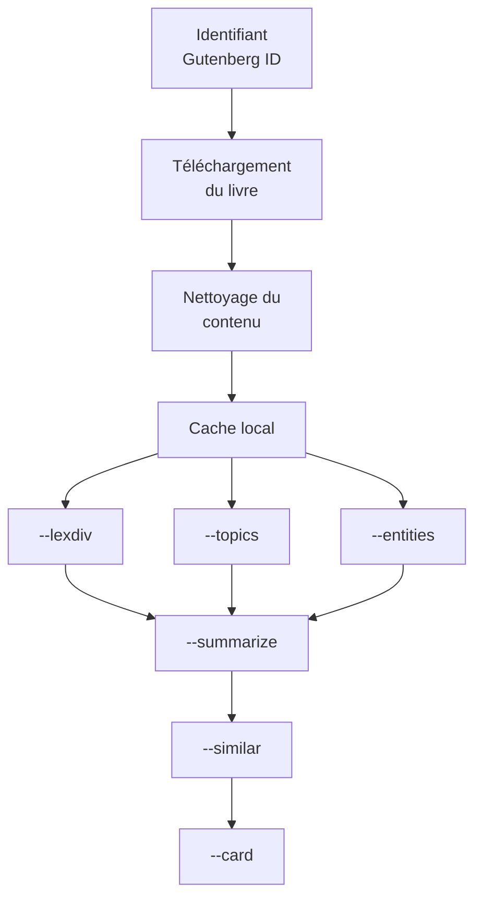
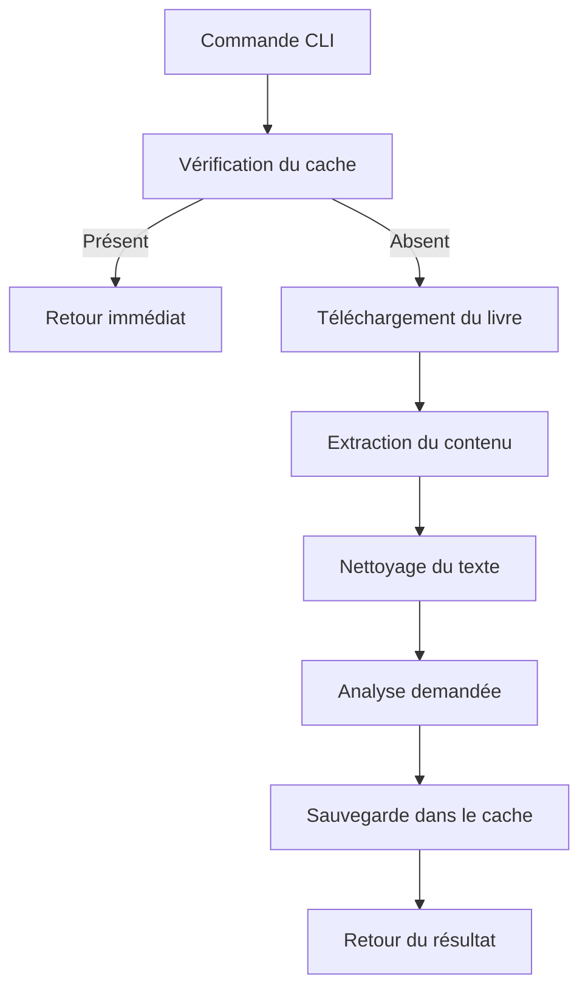

# 📚 Bookworm

## Présentation

**Bookworm** est le point d'entrée principal du projet. Il permet de récupérer automatiquement des ouvrages depuis le catalogue Project Gutenberg, de nettoyer leur contenu puis d'exécuter différents traitements d'analyse littéraire via une interface en ligne de commande (CLI).

Le système est conçu pour minimiser les temps d'exécution grâce à :

* un chargement dynamique des modules uniquement lorsqu'ils sont nécessaires ;
* un système de cache évitant le recalcul des analyses déjà effectuées ;
* un téléchargement automatique des ouvrages manquants.

---

# Fonctionnalités

À partir d'un identifiant Gutenberg, Bookworm permet :

| Commande      | Description                                         |
| ------------- | --------------------------------------------------- |
| `--lexdiv`    | Analyse la richesse du vocabulaire utilisé          |
| `--topics`    | Extrait les thèmes principaux du livre              |
| `--entities`  | Identifie les personnages, lieux et entités nommées |
| `--summarize` | Génère un résumé du livre                           |
| `--similar`   | Recherche des ouvrages similaires                   |
| `--card`      | Exécute l'ensemble des analyses précédentes         |

---

# Architecture générale



---

# Structure du module

```text
project/
│
├── bookworm.py
├── cache.py
├── lexdiv.py
├── topics.py
├── entities.py
├── summarize.py
├── similar.py
│
├── books/
│   └── *.txt
│
└── cache/
    └── *.json
```

---

# Workflow d'exécution



---

# Gestion des livres

## Téléchargement

Les ouvrages sont récupérés depuis Project Gutenberg via l'URL :

```text
https://www.gutenberg.org/cache/epub/<ID>/pg<ID>.txt
```

Exemple :

```text
https://www.gutenberg.org/cache/epub/78788/pg78788.txt
```

Si le fichier est déjà présent dans le dossier `books/`, aucun téléchargement n'est effectué.

---

# Nettoyage du contenu

Le traitement de nettoyage vise à améliorer la qualité des futures analyses NLP.

Les opérations effectuées incluent :

* suppression des métadonnées Gutenberg ;
* suppression des annotations entre crochets ;
* suppression des titres de chapitres ;
* suppression des numéros romains isolés ;
* normalisation des espaces ;
* suppression des caractères typographiques parasites ;
* réduction des blocs de lignes vides.

---

# Extraction du corps du livre

Les fichiers Gutenberg contiennent généralement :

```text
+------------------------+
| Informations du livre  |
+------------------------+
| Contenu du livre       |
+------------------------+
| Mentions légales       |
+------------------------+
```


---

# Chargement dynamique des modules

Afin d'améliorer les performances, aucun module d'analyse n'est chargé au démarrage.

Les imports sont effectués uniquement lorsque la commande correspondante est exécutée.

Exemple :

```python
case "--topics":
    from topics import extract_topics
```

Cette approche réduit :

* le temps de démarrage ;
* l'utilisation mémoire ;
* le chargement inutile de modèles NLP.

---

# Système de cache

Chaque analyse est enregistrée dans un fichier JSON.

```text
cache/
└── <bookid>.json
```

Avant toute exécution :

```python
cache = ch.cacheGestion(bookid,param)
```

Si le résultat existe déjà :

```python
return cache
```

Le traitement est immédiatement retourné sans recalcul.

---

# Commande --card

La commande `--card` agit comme un agrégateur.

Elle exécute automatiquement :

```text
--lexdiv
--topics
--entities
--summarize
--similar
```

puis retourne une fiche complète de l'ouvrage.

Extrait :

```python
for i in cliCommande:
    cliExecute(i, bookid)
```

---

# Exemple d'utilisation

Analyse de la richesse lexicale :

```bash
python bookworm.py --lexdiv 78788
```

Extraction des thèmes :

```bash
python bookworm.py --topics 78788
```

Résumé :

```bash
python bookworm.py --summarize 78788
```

Carte complète :

```bash
python bookworm.py --card 78788
```

---

# Exemple de sortie JSON pour card

```json
{
  "info": {
    "id": "11",
    "authors": "Lewis Carroll",
    "bookshelves": null
  },
  "--lexdiv": {
    "tok": 26500,
    "typ": 4445,
    "hap": 2605,
    "ttr": 0.16773584905660377,
    "mwl": 4.276037735849057,
    "mwf": 5.961754780652418
  },
  "--topics": {
    "1": [
        "dodo",
      "mouse"
    ],
    "2":[
        "queen",
        "king"
    ]
  },
  "--entities": {
    "characters": [
        "alice",
        "queen"
    ],
    "locations": [
        "wonderlande",
        "London"
    ]
  },
  "--summarize":"le résumer du livre",
  "--similar": [
    "Through the Looking-Glass",
    "The Secret Garden",
    "Peter Pan",
    "The Jungle Book",
    "The Wonderful Wizard of Oz"
  ]
  
}
```

---

# Dépendances

## Python

* Python 3.13

## Bibliothèques

Modules internes :

```text
cache.py
lexdiv.py
topics.py
entities.py
summarize.py
similar.py
```

---

# Objectifs techniques

* Téléchargement automatisé d'ouvrages Gutenberg
* Prétraitement NLP robuste
* Architecture modulaire
* Chargement paresseux (Lazy Loading)
* Mise en cache des analyses
* Interface CLI simple
* Extensible pour de nouveaux traitements NLP
