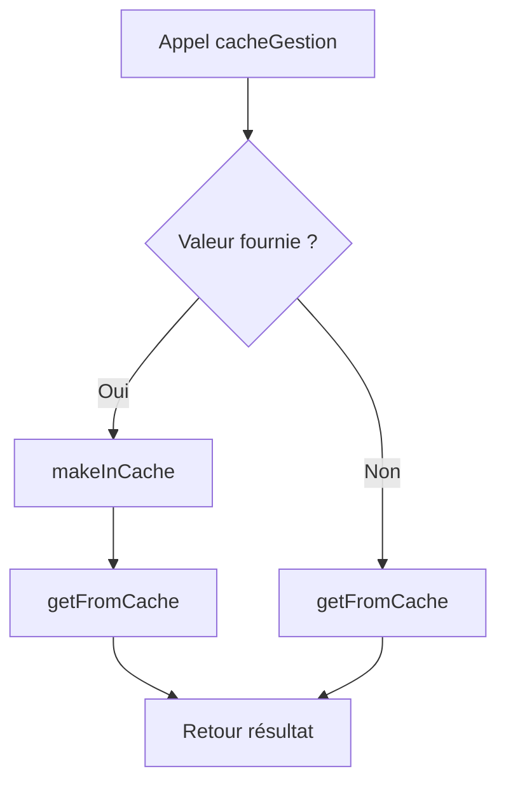

# 🗄️ Cache

## Présentation

Le module **cache.py** est responsable de la gestion centralisée du système de cache du projet.

Son objectif est de conserver les résultats des différentes analyses effectuées sur les livres afin d'éviter de recalculer des données déjà produites.

Chaque livre possède son propre fichier cache au format JSON contenant :

* les informations générales du livre ;
* les résultats des analyses exécutées ;
* les données nécessaires à la génération d'une fiche complète (`--card`).

Cette approche améliore considérablement les performances du projet en réduisant le temps d'exécution des traitements NLP.

---

# Objectifs

Le module assure les responsabilités suivantes :

* création automatique des fichiers de cache ;
* lecture des données mises en cache ;
* écriture des résultats d'analyse ;
* récupération des données associées à un CLI spécifique ;
* agrégation des résultats pour la commande `--card`.

---

# Architecture

```text
                  +----------------+
                  | Commande CLI   |
                  +--------+-------+
                           |
                           v
                  +----------------+
                  | cacheGestion() |
                  +--------+-------+
                           |
          +----------------+----------------+
          |                                 |
          v                                 v
   getFromCache()                 makeInCache()
          |                                 |
          v                                 v
      Lecture JSON                  Écriture JSON
          |                                 |
          +----------------+----------------+
                           |
                           v
                  cache/<id>.json
```

---

# Structure du cache

Chaque livre possède un fichier dédié :

```text
cache/
└── <book_id>.json
```

Exemple :

```text
cache/
└── 78788.json
```

---

# Format du fichier JSON

Lors de la création initiale du cache :

```json
{
  "info": {
    "id": "78788",
    "authors": "Beriah Botfield",
    "bookshelves": null
  }
}
```

Après plusieurs analyses :

```json
{
  "info": {
    "id": "11",
    "authors": "Lewis Carroll",
    "bookshelves": null
  },
  "--lexdiv": {
    "tok": 26500,
    "typ": 4445,
    "hap": 2605,
    "ttr": 0.16773584905660377,
    "mwl": 4.276037735849057,
    "mwf": 5.961754780652418
  },
  "--topics": {
    "1": [
        "dodo",
      "mouse"
    ],
    "2":[
        "queen",
        "king"
    ]
  },
  "--entities": {
    "characters": [
        "alice",
        "queen"
    ],
    "locations": [
        "wonderlande",
        "London"
    ]
  },
  "--summarize":"le résumer du livre",
  "--similar": [
    "Through the Looking-Glass",
    "The Secret Garden",
    "Peter Pan",
    "The Jungle Book",
    "The Wonderful Wizard of Oz"
  ]
  
}
```

---

# Fonctionnement général

Le module repose principalement sur une fonction centrale :

```python
cacheGestion(id, param, value=None)
```

Cette fonction agit comme point d'entrée unique pour l'ensemble des opérations de cache.

---

# Workflow



---

# Fonctions principales

## openJson()

Charge un fichier JSON et retourne son contenu.

### Signature

```python
openJson(path)
```

### Paramètres

| Paramètre | Description            |
| --------- | ---------------------- |
| path      | Chemin du fichier JSON |


---

## createFile()

Crée automatiquement un fichier de cache pour un livre.

Cette fonction extrait certaines métadonnées du livre :

* identifiant Gutenberg ;
* auteur ;

### fichier de cache

```python
createFile(id, bookStart)
```

### Exemple de sortie

```json
{
  "info": {
    "id": "11",
    "authors": "Lewis Carroll",
    "bookshelves": null
  }
}
```

---

## makeInCache()

Ajoute ou met à jour une valeur dans le cache.

Le paramètre utilisé comme clé correspond directement à la commande CLI.

### Signature

```python
makeInCache(id, param, value)
```

### Exemple

```python
makeInCache(
    "11",
    "--lexdiv",
    {
    "tok": 26500,
    "typ": 4445,
    "hap": 2605,
    "ttr": 0.16773584905660377,
    "mwl": 4.276037735849057,
    "mwf": 5.961754780652418
    }
)
```

Résultat :

```json
{
  "--topics": {
    "tok": 26500,
    "typ": 4445,
    "hap": 2605,
    "ttr": 0.16773584905660377,
    "mwl": 4.276037735849057,
    "mwf": 5.961754780652418
  }
}
```

---

## getFromCache()

Récupère une valeur depuis le cache.

Deux comportements sont possibles :

### Cas standard

Retourne uniquement la donnée associée au paramètre demandé.

```python
getFromCache("11", "--lexdiv")
```

Retour :

```python
[
    {
    "tok": 26500,
    "typ": 4445,
    "hap": 2605,
    "ttr": 0.16773584905660377,
    "mwl": 4.276037735849057,
    "mwf": 5.961754780652418
    }
]
```

---

### Cas particulier : --card

Lorsque le paramètre vaut :

```python
"--card"
```

la totalité du fichier cache est retournée.

```python
getFromCache("11", "--card")
```

Retour :

```python
{
    "info": {...},
    "--lexdiv":{...},
    "--topics": [...],
    "--entities": {...},
    "--summarize": "...",
    "--similar":[...],
}
```

---

## Traitement spécifique des résumés

Les résumés générés peuvent contenir :

* des retours à la ligne ;
* des guillemets problématiques ;
* des espaces multiples.

Avant le retour du cache, la fonction applique automatiquement un nettoyage :

```python
element.replace("\n","")
       .replace("\"","'")
       .replace("  "," ")
```

afin de produire un texte directement exploitable notament pour le summarize.

---

## cacheGestion()

Fonction principale utilisée dans l'ensemble du projet.

### Signature

```python
cacheGestion(id, param, value=None)
```

### Écriture

```python
cacheGestion(
    "11",
    "--lexdiv",
    lexdiv
)
```

### Lecture

```python
cacheGestion(
    "11",
    "--lexdiv"
)
```

Cette fonction garantit que les autres modules n'ont jamais besoin d'appeler directement :

```python
makeInCache()
getFromCache()
```

---

# Intégration avec Bookworm

Lors de l'exécution d'une commande :

```text
python bookworm.py --lexdiv 11
```

le workflow est le suivant :

```text
Bookworm
    |
    v
cacheGestion()
    |
    +--> Donnée présente ?
    |        |
    |        +--> Oui : retour immédiat
    |
    +--> Non :
              |
              +--> calcul NLP
              |
              +--> makeInCache()
              |
              +--> getFromCache()
```

---

# Avantages

## Performance

Les traitements NLP peuvent être coûteux.

Le cache évite :

* le recalcul de la richesse ;
* le recalcul des thèmes ;
* le recalcul des entités ;
* le recalcul des résumés ;
* la recherche répétée de livres similaires.

---

## Centralisation

Toutes les opérations de lecture et d'écriture passent par un seul module.

Cela garantit :

* une structure uniforme ;
* une maintenance simplifiée ;
* une meilleure extensibilité.

---

## Extensibilité

L'ajout d'un nouveau CLI ne nécessite aucune modification du système de cache.

Exemple :

```python
cacheGestion(
    bookid,
    "--sentiment",
    sentiment_result
)
```

Le nouveau résultat sera automatiquement stocké dans le fichier JSON.

---

# Résumé

Le module **cache.py** constitue la couche de persistance légère du projet.

Il centralise :

* la création des fichiers cache ;
* l'écriture des résultats NLP ;
* la récupération des données ;
* l'agrégation des informations pour les fiches complètes (`--card`).

Grâce à cette architecture, les analyses déjà calculées sont réutilisées instantanément, réduisant fortement les temps d'exécution globaux du projet.
