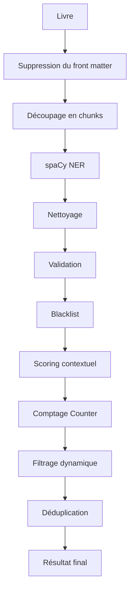

# 👤 Entity Extraction Engine

## Présentation

Le module **entities.py** est responsable de l'identification des personnages et des lieux présents dans un ouvrage.

Son objectif est de produire une liste hiérarchisée des entités les plus importantes du récit afin d'alimenter les autres modules du projet, notamment :

* `summarize.py`
* `similar.py`
* `bookworm.py`

La version actuelle repose sur une pipeline d'extraction enrichie combinant :

* détection des entités nommées via spaCy ;
* nettoyage des résultats ;
* validation des entités ;
* filtrage par blacklist ;
* pondération contextuelle ;
* comptage des fréquences ;
* déduplication intelligente.

Cette approche permet d'obtenir des résultats significativement plus fiables qu'une extraction NER classique.

---

# Évolution du système

## Première version

La première implémentation utilisait uniquement spaCy :

```text
Texte
   |
   v
 spaCy NER
   |
   v
Set(Personnes)
Set(Lieux)
```

Cette approche validait rapidement le concept mais présentait plusieurs limitations.

---

## Problèmes rencontrés

Les résultats contenaient de nombreux faux positifs :

```text
Chapter
Author
Contents
Project Gutenberg
Illustration
```

De plus :

* aucune hiérarchisation n'était réalisée ;
* tous les personnages avaient le même poids ;
* les entités secondaires apparaissaient au même niveau que les protagonistes.

---

## Version actuelle

La pipeline actuelle applique plusieurs couches de traitement.

```text
Texte
   |
   v
Suppression Front Matter
   |
   v
spaCy NER
   |
   v
Nettoyage
   |
   v
Validation
   |
   v
Blacklist
   |
   v
Scoring contextuel
   |
   v
Comptage des fréquences
   |
   v
Filtrage dynamique
   |
   v
Déduplication
   |
   v
Personnages / Lieux
```

---

# Architecture générale



---

# Dépendances

## spaCy

Le moteur principal d'extraction repose sur spaCy.

Installation automatique :

```python
import spacy
```

Modèle utilisé :

```text
en_core_web_sm
```

Téléchargé automatiquement s'il est absent.

---

# Gestion des grands ouvrages

Les ouvrages Project Gutenberg peuvent dépasser plusieurs centaines de milliers de caractères.

Pour éviter les limitations mémoire de spaCy :

```python
chunk_size = 100_000
```

Le texte est découpé en blocs.

```text
Livre complet
      |
      +--> Chunk 1
      |
      +--> Chunk 2
      |
      +--> Chunk N
```

Chaque bloc est traité indépendamment.

---

# Suppression du Front Matter

## Objectif

Les ouvrages Gutenberg contiennent souvent :

* préfaces ;
* citations ;
* notes éditoriales ;
* tables des matières.

Ces éléments introduisent de nombreux faux positifs.

---

## Fonction

```python
trim_front_matter()
```

La fonction recherche le véritable début du livre :

```text
CHAPTER I
CHAPTER 1
Chapter I
Chapter 1
```

et ignore tout ce qui précède.

---

# Nettoyage des entités

## Fonction

```python
clean_entity_text()
```

Les entités détectées sont normalisées :

Avant :

```text
"Alice,"
```

Après :

```text
Alice
```

---

## Opérations appliquées

* suppression des espaces inutiles ;
* suppression de la ponctuation ;
* normalisation du texte.

Exemple :

```text
(Alice)
```

devient :

```text
Alice
```

---

# Validation des entités

## Fonction

```python
is_valid_entity()
```

Cette étape élimine les détections incohérentes.

---

## Critères de rejet

### Entité vide

```text
""
```

---

### Chiffres romains

```text
I
II
III
IV
```

---

### Caractères spéciaux

```text
@#$%^
```

---

### Taille excessive

Plus de :

```text
40 caractères
```

---

### Trop de mots

Plus de :

```text
4 mots
```

---

### Commence par une minuscule

```text
wonderland
```

---

### Acronyme suspect

```text
GUTENBERG
```

---

# Blacklists

## Objectif

Certaines entités sont systématiquement incorrectes.

Exemples :

```text
Chapter
Author
Project Gutenberg
Contents
```

---

## Fichier externe

```text
entities_blacklists.json
```

Cette approche permet :

* d'ajouter des exceptions ;
* de corriger des faux positifs ;
* de maintenir facilement les règles.

---

# Extraction contextuelle

La fréquence seule n'est pas suffisante pour identifier les personnages importants.

Une analyse du contexte est également effectuée.

---

# Indicateurs de personnages

Exemples :

```text
said
asked
replied
cried
answered
```

Lorsqu'un personnage apparaît à proximité :

```text
Alice said
```

son score augmente.

---

# Indicateurs de lieux

Exemples :

```text
in
at
from
near
inside
```

Lorsqu'un lieu apparaît dans un contexte géographique :

```text
in Wonderland
```

son score augmente.

---

# Fonctionnement

```python
has_indicator()
```

Analyse les quelques mots précédant l'entité :

```text
[said] Alice
```

```text
[in] Wonderland
```

---

# Bonus lié au titre

## Objectif

Les personnages ou lieux présents dans le titre sont souvent centraux dans le récit.

Exemple :

```text
Alice's Adventures in Wonderland
```

Contient :

```text
Alice
Wonderland
```

Ces éléments reçoivent un bonus supplémentaire.

---

## Pondération

### Personnages

```python
score += 3
```

### Lieux

```python
score += 4
```

Cette pondération améliore fortement la pertinence des résultats.

---

# Comptage des fréquences

Le module utilise :

```python
Counter
```

pour comptabiliser les occurrences pondérées.

Exemple :

```python
Counter({
    "Alice": 152,
    "Rabbit": 54,
    "Queen": 41
})
```

Les personnages les plus présents remontent naturellement dans le classement.

---

# Filtrage dynamique

## Problème

Un seuil fixe fonctionne mal selon la taille du livre.

Un personnage secondaire peut apparaître :

```text
3 fois
```

dans une nouvelle,

mais être insignifiant dans un roman de :

```text
150 000 mots
```

---

## Solution

Les seuils sont adaptés automatiquement.

### Petit livre

```text
< 40 000 mots
```

```python
min_char_count = 2
```

---

### Livre moyen

```text
40 000 à 100 000 mots
```

```python
min_char_count = 3
```

---

### Grand livre

```text
> 100 000 mots
```

```python
min_char_count = 4
```

---

# Déduplication intelligente

Une même entité peut apparaître sous plusieurs formes.

Exemple :

```text
Alice
Alice Liddell
```

ou

```text
Mr Darcy
Darcy
```

---

## Fonction

```python
deduplicate_by_frequency()
```

Le système conserve la variante la plus représentative.

Avant :

```python
[
    "Alice",
    "Alice Liddell"
]
```

Après :

```python
[
    "Alice"
]
```

---

# Résultat final

Le module retourne une structure standardisée.

```json
{
  "characters": [
    "Alice",
    "White Rabbit",
    "Queen of Hearts",
    "Mad Hatter"
  ],
  "locations": [
    "Wonderland",
    "Rabbit Hole",
    "Queen's Garden"
  ]
}
```

---

# Exemple complet

## Entrée

```text
Alice said she was going to Wonderland.

Later Alice met the White Rabbit.

The White Rabbit ran through Wonderland.
```

---

## Analyse

```text
Alice
    fréquence : élevée
    contexte : "said"
    bonus titre : oui

White Rabbit
    fréquence : moyenne
    contexte : personnage

Wonderland
    fréquence : élevée
    contexte : "in"
    bonus titre : oui
```

---

## Sortie

```json
{
  "characters": [
    "Alice",
    "White Rabbit"
  ],
  "locations": [
    "Wonderland"
  ]
}
```

---

# Complexité

## Temps

L'algorithme parcourt chaque chunk une seule fois :

```text
O(n)
```

hors coût interne du modèle spaCy.

---

## Mémoire

Principalement liée :

* au document spaCy ;
* aux compteurs ;
* aux entités conservées.

Le découpage en chunks permet de contrôler la consommation mémoire sur les très grands ouvrages.

---

# Intégration avec le projet

```text
bookworm.py
      |
      v
entities.py
      |
      +--> summarize.py
      |
      +--> cache.py
      |
      +--> similar.py
```

Les résultats sont automatiquement stockés dans le cache puis réutilisés par les autres modules.

---

# Résumé

Le module **entities.py** fournit une extraction robuste des personnages et des lieux à partir des ouvrages Project Gutenberg.

La version actuelle dépasse largement une simple extraction spaCy grâce à l'ajout de :

* nettoyage des entités ;
* validation avancée ;
* blacklists configurables ;
* scoring contextuel ;
* pondération par fréquence ;
* bonus liés au titre ;
* filtrage dynamique ;
* déduplication intelligente.

Cette combinaison permet d'obtenir des listes d'entités plus précises, plus pertinentes et mieux hiérarchisées, adaptées à l'analyse littéraire automatisée du projet.
