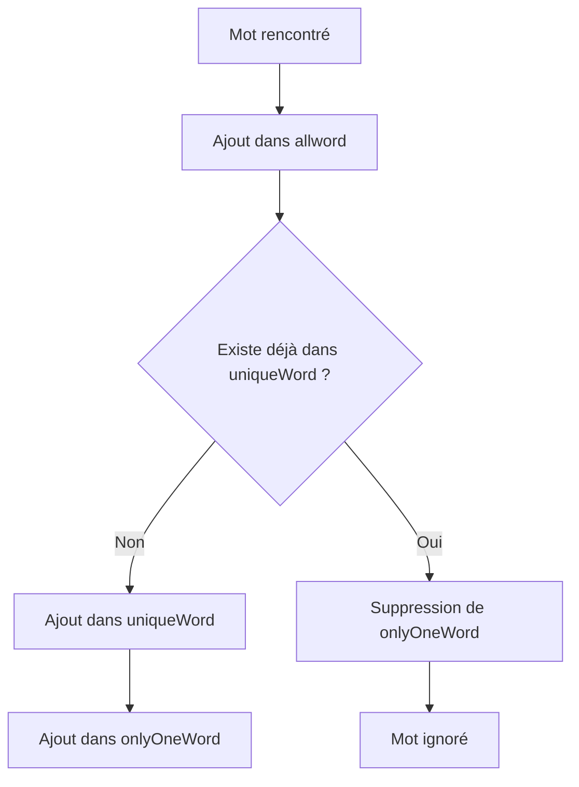

# 📖 DIversité lexical

## Présentation

Le module **lexdiv.py** est responsable de l'analyse de la richesse lexicale d'un ouvrage.

Son objectif est de mesurer la diversité du vocabulaire utilisé dans un texte à travers plusieurs indicateurs statistiques couramment employés en linguistique computationnelle et en traitement automatique du langage naturel (NLP).

L'analyse repose sur un découpage simple du texte en mots puis sur la construction de plusieurs ensembles permettant de calculer différentes métriques lexicales.

---

# Objectifs

Le module permet de déterminer :

* le nombre total de mots présents ;
* le nombre de mots différents utilisés ;
* le nombre de mots apparaissant une seule fois ;
* le ratio de diversité lexicale ;
* la longueur moyenne des mots ;
* la fréquence moyenne de réutilisation du vocabulaire.

---

# Principe de fonctionnement

Le texte du livre est récupéré puis découpé selon les espaces.

```python
text.split(" ")
```

Chaque mot rencontré est ensuite traité et classé dans plusieurs catégories.

---

# Architecture

```text
                Texte du livre
                       |
                       v
               Découpage en mots
                       |
                       v
        +--------------+--------------+
        |              |              |
        v              v              v
    allword      uniqueWord     onlyOneWord
        |              |              |
        +--------------+--------------+
                       |
                       v
             Calcul des métriques
                       |
                       v
                 Résultat JSON
```

---

# Structures utilisées

Le calcul repose sur trois collections distinctes.

## allword

Contient tous les mots rencontrés dans le texte.

Exemple :

```text
The cat is black.
The cat sleeps.
```

Résultat :

```python
[
    "The",
    "cat",
    "is",
    "black.",
    "The",
    "cat",
    "sleeps."
]
```

Cette liste permet de calculer le nombre total de mots.

---

## uniqueWord

Contient uniquement les mots distincts.

Les comparaisons sont effectuées en minuscules afin d'éviter les doublons liés à la casse.

Exemple :

```text
The
the
THE
```

Résultat :

```python
[
    "the"
]
```

Sans cette normalisation, chaque variante serait considérée comme un mot différent.

---

## onlyOneWord

Contient uniquement les mots apparaissant une seule fois dans le texte.

Lorsqu'un mot est rencontré pour la première fois :

```text
word
```

il est ajouté dans :

```python
uniqueWord
onlyOneWord
```

Lorsqu'il apparaît une seconde fois :

```text
word
```

il reste dans :

```python
uniqueWord
```

mais est supprimé de :

```python
onlyOneWord
```

---

# Workflow de traitement



---

# Gestion de la casse

Afin d'obtenir des statistiques fiables, toutes les comparaisons sont effectuées en minuscules.

Exemple :

```text
London
LONDON
london
```

devient :

```python
london
```

Cette normalisation évite de considérer un même mot comme plusieurs termes distincts.

Code utilisé :

```python
i.lower()
```

---

# Fonction principale

## lexdiv()

Analyse le contenu textuel du livre et retourne l'ensemble des indicateurs lexicaux.

### Signature

```python
lexdiv(array)
```

### Paramètre

| Paramètre | Description                                                  |
| --------- | ------------------------------------------------------------ |
| array     | Structure retournée par Bookworm contenant le texte du livre |

---

# Fonction auxiliaire

## lenghAverageWord()

Calcule la longueur moyenne des mots.

### Signature

```python
lenghAverageWord(array)
```

### Principe

```text
Nombre total de caractères
            /
Nombre total de mots
```

---

# Métriques calculées

## TOK — Total Word Tokens

Nombre total de mots rencontrés.

```text
TOK = nombre total de mots
```

Exemple :

```text
The cat sleeps
```

Résultat :

```text
TOK = 3
```

---

## TYP — Unique Word Types

Nombre de mots distincts.

```text
TYP = nombre de mots différents
```

Exemple :

```text
The cat cat
```

Résultat :

```text
TYP = 2
```

---

## HAP — Hapax Legomena

Nombre de mots apparaissant exactement une seule fois.

```text
HAP = nombre de mots uniques
```

Exemple :

```text
cat dog cat bird
```

Résultat :

```text
HAP = 2
```

Mots concernés :

```text
dog
bird
```

---

## TTR — Type Token Ratio

Mesure la diversité lexicale du texte.

Plus la valeur est élevée, plus le vocabulaire est varié.

Formule :

TTR=\frac{TYP}{TOK}

Exemple :

```text
TOK = 1000
TYP = 500
```

Résultat :

```text
TTR = 0.5
```

---

## MWL — Mean Word Length

Longueur moyenne des mots.

Formule :

MWL=\frac{\text{Nombre total de caractères}}{TOK}

Cette métrique donne une indication sur la complexité lexicale du texte.

---

## MWF — Mean Word Frequency

Nombre moyen d'utilisations d'un même mot.

Formule :

MWF=\frac{TOK}{TYP}

Une valeur élevée indique une forte répétition du vocabulaire.

---

# Structure du résultat

La fonction retourne un dictionnaire JSON contenant l'ensemble des métriques.

Exemple :

```json
{
  "tok": 75432,
  "typ": 10358,
  "hap": 4821,
  "ttr": 0.1373,
  "mwl": 4.82,
  "mwf": 7.28
}
```

---

# Exemple d'exécution

```python
result = lexdiv(book)
```

Résultat :

```python
{
    "tok": 75432,
    "typ": 10358,
    "hap": 4821,
    "ttr": 0.1373,
    "mwl": 4.82,
    "mwf": 7.28
}
```

---

# Interprétation des résultats

| Indicateur | Signification                                                |
| ---------- | ------------------------------------------------------------ |
| TOK élevé  | Livre volumineux                                             |
| TYP élevé  | Vocabulaire riche                                            |
| HAP élevé  | Grande variété lexicale                                      |
| TTR élevé  | Faible répétition des mots                                   |
| MWL élevé  | Mots plus longs et vocabulaire potentiellement plus complexe |
| MWF élevé  | Réutilisation fréquente du même vocabulaire                  |

---

# Dépendances

Aucune dépendance externe n'est requise.

Le module utilise uniquement les fonctionnalités natives de Python.

---

# Résumé

Le module **lexdiv.py** fournit une analyse rapide et légère de la richesse lexicale d'un ouvrage.

Grâce à trois structures simples (`allword`, `uniqueWord`, `onlyOneWord`), il permet de calculer plusieurs indicateurs fondamentaux de diversité lexicale utilisés en linguistique computationnelle :

* TOK (Total Tokens)
* TYP (Types)
* HAP (Hapax Legomena)
* TTR (Type Token Ratio)
* MWL (Mean Word Length)
* MWF (Mean Word Frequency)

Ces statistiques constituent la base des analyses stylistiques et comparatives réalisées par le projet.
