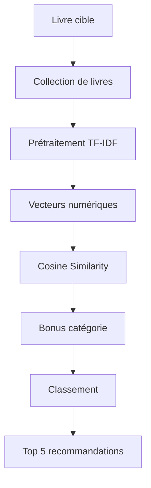
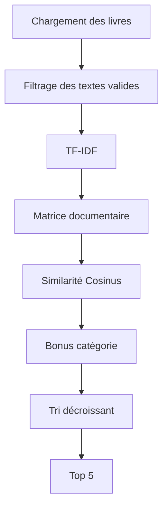

# 📚 Similar Books Recommender

## Présentation

Le module **similar.py** est responsable de la recommandation de livres similaires à partir du contenu textuel d'un ouvrage.

Son objectif est d'identifier les livres les plus proches d'un livre cible en analysant leur vocabulaire et leur thématique générale.

La solution retenue repose sur une combinaison de :

```text
TF-IDF
   ↓
Cosine Similarity
   ↓
Bonus de catégorie
   ↓
Top 5 recommandations
```

Cette approche fournit un compromis efficace entre précision, rapidité et simplicité d'explication.

---

# Objectif

À partir d'un identifiant Gutenberg, le module doit répondre à la question :

> "Quels sont les livres les plus proches de celui-ci ?"

Le résultat est utilisé par la commande :

```bash
python bookworm.py --similar <book_id>
```

---

# Architecture générale



---

# Pipeline de recommandation

```text
Livre cible
      |
      v
Vectorisation TF-IDF
      |
      v
Calcul Similarité Cosinus
      |
      v
Ajout Bonus Catégorie
      |
      v
Tri décroissant
      |
      v
5 meilleurs résultats
```

---

# Pourquoi TF-IDF ?

## Principe

TF-IDF (*Term Frequency - Inverse Document Frequency*) transforme chaque livre en un vecteur numérique représentant les termes les plus significatifs du texte.

Les mots :

```text
the
and
of
```

sont peu valorisés car présents dans presque tous les livres.

À l'inverse :

```text
whale
pirate
wonderland
detective
```

obtiennent un poids plus important lorsqu'ils caractérisent fortement un ouvrage.

---

## Objectif

Conserver uniquement le vocabulaire réellement discriminant.

---

## Exemple simplifié

```text
Livre A
---------
whale whale ship sea

Livre B
---------
ship sea ocean whale

Livre C
---------
detective crime london
```

Après vectorisation :

```text
A ≈ B
A ≠ C
```

---

# Pourquoi la Similarité Cosinus ?

Une fois les livres convertis en vecteurs, il faut mesurer leur proximité.

Le module utilise la similarité cosinus.

---

## Principe

La méthode compare l'orientation de deux vecteurs plutôt que leur taille.

Deux livres peuvent avoir :

```text
50 000 mots
```

et

```text
200 000 mots
```

tout en restant proches s'ils utilisent un vocabulaire similaire.

---

## Formule

\cos(\theta)=\frac{A\cdot B}{|A||B|}

---

## Interprétation

| Valeur | Signification          |
| ------ | ---------------------- |
| 1      | Livres très similaires |
| 0      | Aucun lien lexical     |
| -1     | Opposés (cas rare ici) |

---

# Pourquoi les bigrammes ?

La vectorisation utilise :

```python
ngram_range=(1, 2)
```

Cela signifie que le modèle conserve :

* les mots seuls (*unigrammes*) ;
* les groupes de deux mots (*bigrammes*).

---

## Exemple

Texte :

```text
Peter Pan
Sherlock Holmes
Secret Garden
Moby Dick
```

Le système conserve :

```text
Peter
Pan
Peter Pan

Sherlock
Holmes
Sherlock Holmes

Moby
Dick
Moby Dick
```

---

## Avantage

Les expressions importantes sont mieux représentées.

Sans bigrammes :

```text
Sherlock
Holmes
```

sont considérés séparément.

Avec les bigrammes :

```text
Sherlock Holmes
```

devient une entité lexicale forte.

Cela améliore significativement la qualité des recommandations.

---

# Paramètres TF-IDF

Le modèle est configuré avec :

```python
TfidfVectorizer(
    lowercase=True,
    stop_words="english",
    token_pattern=r"\b[a-zA-Z]{3,}\b",
    max_features=10000,
    sublinear_tf=True,
    min_df=2,
    max_df=0.85,
    ngram_range=(1, 2)
)
```

---

## Détail des paramètres

### lowercase=True

Normalisation du texte :

```text
Alice
ALICE
alice
```

devient :

```text
alice
```

---

### stop_words="english"

Suppression automatique des mots très fréquents :

```text
the
of
and
is
```

---

### min_df=2

Ignore les termes présents dans un seul document.

---

### max_df=0.85

Ignore les mots présents dans plus de 85 % des livres.

---

### max_features=10000

Limite le vocabulaire aux :

```text
10 000 termes les plus pertinents
```

---

# Bonus de catégorie

## Problème

TF-IDF compare uniquement le vocabulaire.

Deux livres de genres différents peuvent parfois utiliser des mots similaires.

Exemple :

```text
Aventure maritime
Roman historique
```

peuvent partager :

```text
ship
captain
voyage
```

sans appartenir au même univers.

---

## Solution

Le projet dispose d'une collection JSON contenant les catégories.

Exemple :

```json
{
  "123": {
    "title": "Moby Dick",
    "category": "Adventure"
  }
}
```

---

## Règle appliquée

Si deux livres partagent la même catégorie :

```python
score += 0.15
```

---

## Pourquoi 0.15 ?

Le bonus doit :

* améliorer le classement ;
* rester secondaire ;
* ne pas remplacer le score TF-IDF.

Ainsi :

```text
Score TF-IDF : 0.72

Même catégorie :
0.72 + 0.15

= 0.87
```

---

# Filtrage des livres

Avant l'analyse, certains livres sont exclus.

Critère :

```python
len(text.split()) > 200
```

---

## Objectif

Éviter :

* les textes trop courts ;
* les extraits incomplets ;
* les ouvrages insuffisants pour une comparaison fiable.

---

# Fonction principale

## extract_similar()

Fonction responsable de l'ensemble du processus de recommandation.

### Signature

```python
extract_similar(bookid, books_content)
```

---

# Workflow détaillé



---

# Exemple de résultat

Pour un livre d'aventure :

```python
[
    "Treasure Island",
    "The Coral Island",
    "Peter Pan",
    "Robinson Crusoe",
    "The Swiss Family Robinson"
]
```

---

# Alternatives étudiées

## Bag of Words

### Avantages

* très simple ;
* rapide à implémenter.

### Inconvénients

* ignore l'importance des mots ;
* moins performant sur les textes longs.

---

## Word Embeddings

Exemples :

```text
Word2Vec
GloVe
BERT Embeddings
```

---

### Avantages

* meilleure compréhension sémantique ;
* prise en compte du contexte.

---

### Inconvénients

* plus coûteux ;
* plus difficiles à expliquer ;
* nécessitent davantage de ressources ;
* disproportionnés pour les objectifs du projet.

---

# Justification du choix

La combinaison :

```text
TF-IDF
+
Cosine Similarity
+
Category Bonus
```

présente plusieurs avantages.

---

## Performance

Traitement rapide même sur des ouvrages volumineux.

---

## Simplicité

Méthode facile à comprendre et à justifier.

---

## Robustesse

Résultats cohérents sur une collection de livres hétérogène.

---

## Compatibilité académique

Approche adaptée à :

* un projet de recherche ;
* un mémoire ;
* un prototype d'analyse littéraire.

---

# Dépendances

Bibliothèque utilisée :

```bash
pip install scikit-learn
```

Modules principaux :

```python
from sklearn.feature_extraction.text import TfidfVectorizer
from sklearn.metrics.pairwise import cosine_similarity
```

---

# Intégration avec le projet

```text
bookworm.py
      |
      v
similar.py
      |
      +--> books_collection.json
      |
      +--> cache.py
```

Les recommandations produites sont ensuite stockées dans le cache afin d'éviter un recalcul lors des exécutions suivantes.

---

# Résumé

Le module **similar.py** implémente un système de recommandation basé sur l'analyse du vocabulaire des ouvrages.

La méthode retenue repose sur :

* TF-IDF pour représenter les livres ;
* la similarité cosinus pour mesurer leur proximité ;
* les bigrammes pour conserver les expressions importantes ;
* un bonus de catégorie pour renforcer la cohérence des résultats.

Cette approche offre un excellent compromis entre rapidité, légèreté, interprétabilité et qualité des recommandations, ce qui la rend particulièrement adaptée à un projet académique d'analyse littéraire.
