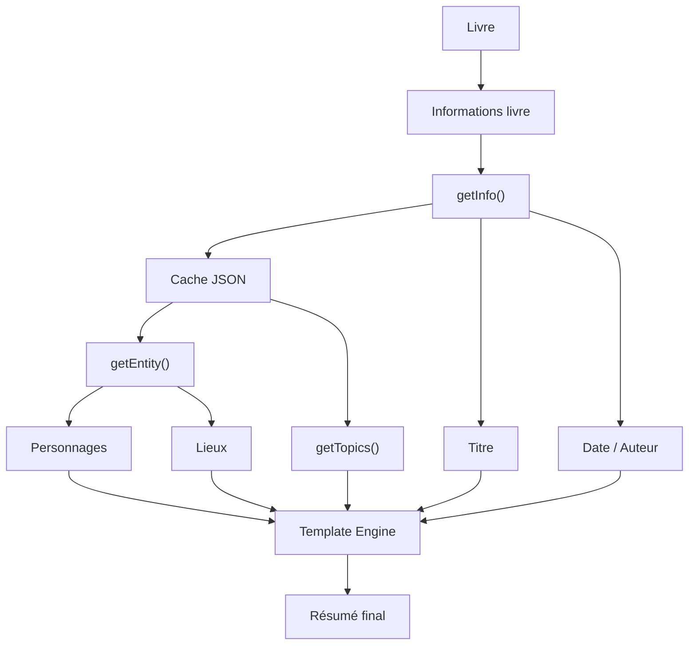
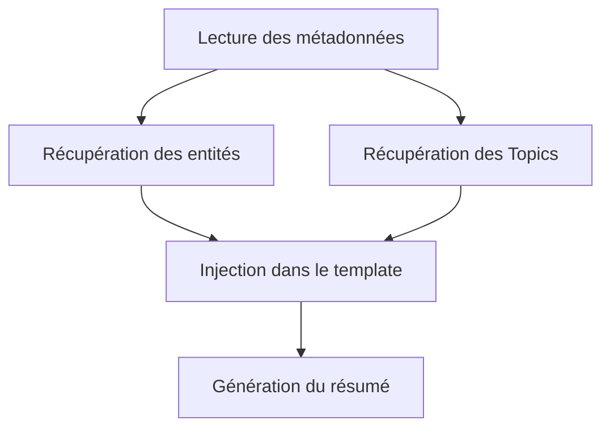

# 📝 Summarize

## Présentation

Le module **summarize.py** est responsable de la génération d'un résumé synthétique d'un ouvrage.

Contrairement aux approches classiques de résumé automatique basées sur l'intelligence artificielle ou les statistiques textuelles, ce module adopte une approche **template-based**.

L'objectif est de produire un résumé :

* cohérent ;
* structuré ;
* immédiatement compréhensible ;
* reproductible ;
* indépendant de la qualité des modèles de résumé automatique.

Le résumé final est construit à partir :

* des métadonnées du livre ;
* des personnages identifiés ;
* des lieux identifiés ;
* d'un modèle de rédaction prédéfini.

---

# Objectifs

Le module permet de :

* récupérer les informations principales du livre ;
* exploiter les entités détectées précédemment ;
* générer automatiquement un résumé homogène ;
* éviter les incohérences observées avec les modèles de résumé automatique.

---

# Architecture



---

# Philosophie du module

Plusieurs techniques de résumé automatique ont été expérimentées avant d'adopter une approche basée sur un template.

Les résultats obtenus avec les modèles NLP ne permettaient pas de produire un résumé directement exploitable pour une présentation rapide du livre.

Le module utilise donc les résultats déjà obtenus par les autres composants du projet afin de construire une description fiable et cohérente.

---

# Fonctionnement général

Le processus se déroule en trois étapes :



---

# Template utilisé

Le résumé est généré à partir du modèle suivant :

```text
"{bookTitle}", was released in {dateMonth} {dateYear} and written by {author}.

This book follows {mainCharacter}, one of the main figures of the narrative. Throughout the story, {mainCharacter} will meet multiple characters like {secondCharacter} who help in the development of that story.

The events take place mainly in {mainPlace}, a location that take an important place for the story.

Through all characters and places, "{bookTitle}" presents a narrative that gradually unfolds around the events, relationships, and situations encountered throughout the book.

The book covers themes including, {theme}.
```

Les variables sont automatiquement remplacées par les données du livre analysé.

---

# Fonction getInfo()

## Rôle

Cette fonction extrait les métadonnées présentes dans l'en-tête Gutenberg.

Informations récupérées :

* titre ;
* auteur ;
* date de publication.

---

## Signature

```python
getInfo(StartBook)
```

---

## Extraction réalisée

Le texte est parcouru afin de retrouver :

```text
Title
Author
Release date
```

Exemple :

```text
Title: Alice's Adventures in Wonderland

Author: Lewis Carroll

Release date: June 27 2008
```

Résultat :

```python
(
    "Alice's Adventures in Wonderland",
    "Lewis Carroll",
    "June 27 2008"
)
```

---

# Fonction getEntity()

## Rôle

Récupère les entités préalablement extraites et stockées dans le cache.

Le module ne réalise aucune analyse NLP supplémentaire.

Il réutilise directement les résultats produits par le module `entities.py`.

---

## Signature

```python
getEntity(bookid)
```

---

## Données récupérées

```json
{
  "--entities": {
    "characters": [
      "Alice",
      "White Rabbit",
      "Queen of Hearts"
    ],
    "locations": [
      "Wonderland",
      "Rabbit Hole"
    ]
  }
}
```

Retour :

```python
(
    ["Alice", "White Rabbit"],
    ["Wonderland"]
)
```

# Fonction getTopics()

## Rôle

Récupère les thèmes préalablement extraites et stockées dans le cache.

Le module ne réalise aucune analyse NLP supplémentaire.

Il réutilise directement les résultats produits par le module `topics.py`.

---

## Signature

```python
getTopics(bookid)
```

---

## Données récupérées

```json
{
  "--topics": {
    "1: fairytale": [
      "sister",
      "earth",
      "watch"
    ],
    "2: journey":  [
      "key",
      "wander",
      "climb"
    ]
  }
}
```
## Applique un traitement

Récupère tous les thèmes pour conserver que les 4 meilleurs

Retour :

```python
(
    ["fairytale", "journey",...]
)
```

---
# Fonction summarize()

## Rôle

Fonction principale du module.

Elle orchestre l'ensemble du processus de génération du résumé.

---

## Signature

```python
summarize(bookid, StartBook)
```

---

## Workflow

```text
summarize()
    |
    +--> getInfo()
    |
    +--> getEntity()
    |
    +--> getTopics()
    |
    +--> récupération des variables
    |
    +--> template.format(...)
    |
    +--> résumé final
```

---

# Exemple de génération

## Variables obtenues

```python
{
    "id": "11",
    "bookTitle": "Alice's Adventures in Wonderland",
    "author": "Lewis Carroll",
    "dateMonth": "June",
    "dateYear": "2008",
    "mainCharacter": "Alice",
    "secondCharacter": "Hatter",
    "thirdCharacter" = "Queen",
    "mainPlace": "Wonderland",
    "theme":"nature, fairytale, family drama and friendship"
}
```

---

## Résultat

```text
"Alice's Adventures in Wonderland", was released in June 2008 and written by Lewis Carroll.

This book follows Alice, one of the main figures of the narrative. Throughout the story, Alice will meet multiple characters like Hatter and Queen who help in the development of that story.

The events take place mainly in Wonderland, a location that take an important place for the story.

Through all characters and places, "Alice's Adventures in Wonderland" presents a narrative that gradually unfolds around the events, relationships, and situations encountered throughout the book.

The book covers themes including, nature, fairytale, family drama and friendship.
```

---

# Études et solutions explorées

Avant l'implémentation actuelle, plusieurs techniques de résumé automatique ont été évaluées.

---

## TF-IDF

### Principe

Identifier les phrases les plus importantes à partir de la fréquence des termes.

### Résultat observé

Les phrases obtenues sont souvent :

* isolées ;
* déconnectées les unes des autres ;
* sans continuité narrative.

### Limitation

Le résultat ressemble davantage à une collection de citations qu'à un véritable résumé.

---

## TextRank

### Principe

Construire un graphe de similarité entre les phrases puis conserver les plus centrales.

### Résultat observé

Les phrases sélectionnées proviennent bien du livre mais restent :

* fragmentées ;
* peu contextualisées ;
* difficiles à interpréter sans connaître l'histoire.

### Limitation

Absence de véritable synthèse.

---

## T5-Small

### Principe

Utilisation d'un modèle Transformer de génération de texte.

### Résultat observé

Le modèle parvient à reformuler certaines informations mais produit souvent :

* des événements désordonnés ;
* des détails anecdotiques ;
* des résumés peu exploitables directement.

Exemple :

```text
a bottle marked '_poison_' was printed on a paper label with the words "DRINK ME"...
```

### Limitation

Le contenu généré manque de structure globale.

---

## DistilBART

### Principe

Résumé automatique basé sur un modèle BART allégé.

Plusieurs stratégies de découpage ont été testées :

* texte complet ;
* phrase par phrase ;
* paragraphe par paragraphe.

---

### Meilleure approche observée

```text
Livre
   |
   v
Découpage en paragraphes
   |
   v
Résumé de chaque paragraphe
   |
   v
Résumé global des résumés
```

---

### Exemple obtenu

```text
Alice saw a White Rabbit with pink eyes pop down a rabbit-hole under a hedge.

Alice went after it, never once considering how she would get out again.

She fell down a well, but it was too dark to see anything.

Alice wondered how many miles she had fallen by this time.
```

---

### Limitation

Même si cette méthode produit les meilleurs résultats parmi les modèles testés :

* les événements restent parfois difficiles à relier ;
* certaines informations importantes sont omises ;
* le résultat dépend fortement du livre analysé.

---

# Pourquoi le template a été retenu

L'approche template présente plusieurs avantages :

| Critère                        | Template                                   | IA générative |
| ------------------------------ | ------------------------------------------ | ------------- |
| Cohérence                      | structure identique                        | Variable      |
| Rapidité                       | ajout de text instantané                   | Plus lente    |
| Consommation mémoire           | presque aucune                             | Élevée        |
| Compréhension immédiate        | texte comprehensible même avec les trous   | Variable      |
| Dépendance à un modèle externe | aucun model nécessaire                     | Oui           |

---

# Intégration avec le projet

Le module dépend directement :

```text
bookworm.py
        |
        v
entities.py
        |
        v
cache.py
        |
        v
summarize.py
```

La commande :

```bash
python bookworm.py --summarize <book_id>
```

déclenche automatiquement la récupération des entités puis la génération du résumé.

---

# Résumé

Le module **summarize.py** fournit une solution de résumé basée sur un template dynamique alimenté par les métadonnées et les entités extraites du livre.

Après plusieurs expérimentations avec TF-IDF, TextRank, T5-Small et DistilBART, cette approche a été retenue pour sa simplicité, sa rapidité et sa capacité à produire un résultat immédiatement compréhensible.

Le module constitue ainsi une couche de présentation synthétique des informations extraites par les autres composants du projet.
