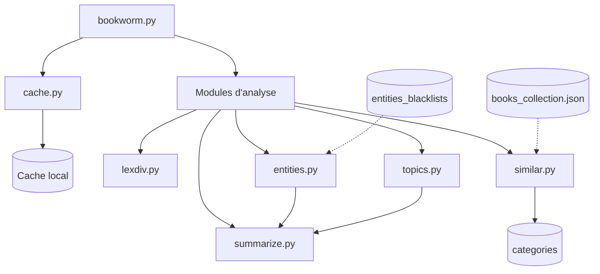
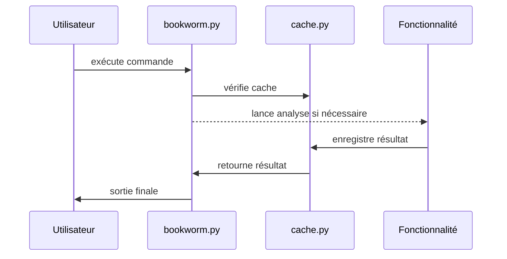

# Bookworm — Moteur d’intelligence de livres

Bookworm est un outil Python conçu pour transformer un livre en une **fiche d’analyse structurée**, destinée aux éditeurs, chercheurs et publieurs.

Son objectif est simple :

> Comprendre un livre en quelques secondes sans avoir à le lire entièrement.

---

# Fonctionnalités

Bookworm extrait plusieurs niveaux d’information à partir d’un livre :

- Analyse de la richesse lexicale
- Détection des thèmes principaux
- Extraction des entités (personnages & lieux)
- Résumé structuré
- Recommandation de livres similaires
- Carte complète du livre

---

# Vue d’ensemble du système



---

# utilisation

```bash
    python bookworm.py --parametre <book_id>
```
---
# Paramètres 

| Paramètre     | Description                         |
| ------------- | ----------------------------------- |
| `--lexdiv`    | Analyse la richesse lexicale        |
| `--topics`    | Extraction des thèmes principaux    |
| `--entities`  | Extraction des personnages et lieux |
| `--summarize` | Génère un résumé structuré          |
| `--similar`   | Trouve des livres similaires        |
| `--card`      | Génère une carte complète du livre  |

---
# mécanisme

